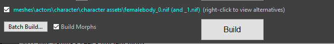

# OBody NG 安装指南

**如果您是从`原版 OBody（需要 OStim 的那个版本）`升级，只需直接用 OBody NG 替换 OBody 即可。**

**如果您是从 `OBody Standalone` 升级，请进入游戏，打开控制台并输入以下命令：**

`stopquest OBodyMCMQuest`

**保存游戏，然后退出游戏。现在卸载 OBody，卸载 OBody Standalone，并安装 OBody NG。**

如果您从未安装过任何版本的 OBody，请继续阅读本指南！

1. 首先，OBody 有几个前置需求。您必须先安装这些 Mod。请注意，您还必须安装以下列出的 Mod 的所有前置 Mod！

   **VR 用户的注意事项：** 虽然 OBody NG 可以在 VR 中运行，但根据报告，效果参差不齐。对于 Skyrim VR 中的绝大多数用户来说，一切都能 100% 正常工作。有一位用户报告说体型随机化在 VR 中对他不起作用。极少数用户报告 UI Extensions 菜单在 VR 中无法正常工作。对于专门在 VR 中出现的问题，我能做的并不多。我没有 Skyrim VR，也没有 VR 头显。因此，请注意，对 VR 问题的支持将非常有限。感谢您的理解
   - **[Racemenu](https://www.nexusmods.com/skyrimspecialedition/mods/19080)**

     对于 Skyrim 版本 1.5.97，获取“Old Files”下的 0.4.16 版本。
     对于 Skyrim 版本 1.6.353，获取“Old Files”下的 0.4.19.11 版本。
     对于 Skyrim 版本 1.6.640，获取“Old Files”下的 0.4.19.14 版本。
     对于 Skyrim 版本 1.6.1130，获取 0.4.19.15 版本。
     对于 GOG 版的 Skyrim，获取“Optional files”下的 0.4.19.14 GOG 版本。
     对于 Skyrim VR，获取主文件，然后获取 Racemenu VR 0.4.14 可选文件（Optional File）。请遵循那里的说明。

   - **[PapyrusUtil](https://www.nexusmods.com/skyrimspecialedition/mods/13048)**

     对于 Skyrim 版本 1.5.97，获取 3.9 版本。
     对于 Skyrim 版本 1.6.353，获取“Old Files”下的 4.3 版本。
     对于 Skyrim 版本 1.6.640，获取“Old Files”下的 4.4 版本。
     对于 Skyrim 版本 1.6.1130，获取 4.5 版本。
     对于 GOG 版的 Skyrim，获取 PapyrusUtil GOG。
     对于 Skyrim VR，获取“Miscellaneous Files”下的 PapyrusUtil 3.6b。

   - **[Bodyslide and Outfit Studio](https://www.nexusmods.com/skyrimspecialedition/mods/201)**

   - **[UIExtensions](https://www.nexusmods.com/skyrimspecialedition/mods/17561)**

   一个替换女性体型、且支持 Bodyslide 以及 Racemenu morphs 的体型 Mod。如今，推荐的是 **[CBBE 3BA](https://www.nexusmods.com/skyrimspecialedition/mods/30174)** 或 **[BHUNP](https://www.nexusmods.com/skyrimspecialedition/mods/31126)**。不过，您可以自由使用其他支持 Bodyslide 和 Racemenu morphs 的 Mod。如果某种体型支持 Bodyslide 但不支持 Racemenu morphs，它将无法工作——COCO body 就是一个例子。

   **请务必只保留一种女性体型 Mod。** 这是 Skyrim modding 的基本规则。不要尝试将 CBBE 3BA 与 BHUNP 或 COCO 混合，或者将任何其他不同体型 Mod 混合在一起。选择其中一种并坚持使用它。

   请注意，CBBE 3BA 需要安装原版 CBBE 才能工作，但它们在技术上是同一种体型。3BA 只是在 CBBE 之上添加了内容，这就是为什么 3BA 安装包会同时安装 CBBE + CBBE 3BA。这完全没问题，也是预期的。

   可选地，一个替换男性体型、且同样支持 Bodyslide 和 Racemenu morphs 的 Mod。如今 **[HIMBO](https://www.nexusmods.com/skyrimspecialedition/mods/46311)** 是用于该目的的首选 Mod。如果您想安装其他不支持 Bodyslide 的男性体型 Mod（SOS Full/Light、SAM Light 等），那也没问题——OBody 不会对它们做任何处理。

   这里也一样，**只保留一种男性体型 Mod。** 不要尝试将 SOS HIMBO 与 SAM Light 或任何类似的东西混合。

   HIMBO 同样需要 SOS 才能正常工作，因此您最终会安装 SOS+HIMBO，因为 HIMBO 是在 SOS 之上添加功能。就像上面提到的 CBBE+CBBE 3BA 组合一样，这完全没问题且符合预期。只要不要在上面再添加完全不同的体型 Mod（如 SAM Light）即可。

   现在，您可以像安装任何其他 Mod 一样，使用您最喜欢的 Mod 管理器安装 OBody NG 了。

2. **如果您要开始新游戏**，可以直接前往步骤 3！

   **如果您是在现有的存档上安装此 Mod** ，那么请先前往没有 NPC 或 NPC 尽可能少的地方！我建议前往荒野中央、某种地下城，甚至是玩家住宅。
   保存游戏，退出游戏，然后前往步骤 3！

3. 打开 Racemenu 的配置文件。该文件位于您安装 Racemenu 的地方，通常在 Vortex 或 MO2 的 mods 文件夹中。在 Racemenu 安装文件夹内，打开 SKSE > Plugins，然后用文本编辑器（如 Notepad）打开文件 skee64。找到以下两行，如有必要请修改它们，使其如下所示：

   ```ini
   ; Enables BodySlide assisted morphing for further customization
   bEnableBodyMorph=1 ; Default[1]

   ; Enables Body Randomization based on guided files (depends on BodyMorph, usage without will still apply randomized key values)
   bEnableBodyGen=0 ; Default[1]
   ```

4. 是时候启动 Bodyslide 了。首先，您需要前往 **Group Filter（组过滤器）** ，并选择您的体型和服装所在的组。请注意，许多服装可能会被归类在 **Unassigned（未分配）** 组中，这通常是下拉列表里的最后一个选项，因此您也需要勾选它！

   您可以参考下面的图片。在我的情况下，我使用的是 BHUNP，但其他体型的处理流程是类似的。对于 CBBE 3BA，您会有其对应的标签和组。

   

5. 在 Outfit/Body（服装/体型）中选择您的主体型。对于 BHUNP 用户，这将是 **BHUNP 3BBB Advanced Ver 3** 或 **BHUNP 3BBB Advanced Ver 4** ；对于 CBBE 3BA 用户，这将是 **CBBE 3BBB Body Amazing**。对于其他体型，您需要自行找出哪个是主体型。请参考您的体型替换 Mod 的说明页面以获取相关说明。

   选择主体型后，在 **Preset（预设）** 下选择 **Zeroed Sliders** 。请始终尽量使用您的体型替换 Mod 所提供的 Zeroed Sliders。如果出于某种原因没有可用的 Zeroed Sliders 预设，则必须自己制作一个 Zeroed Sliders 预设。

   BHUNP 和 CBBE 3BA 的 Zeroed Sliders 预设中可能会有一些滑块处于 100% 的状态。这是正常的且符合预期的。请勿修改它们！

   下面的图片展示了在完成此步骤后，BHUNP 和 CBBE 3BA 的界面看起来会是什么样子：

   

   

6. 在 Bodyslide 界面的底部，勾选 **“Build Morphs”复选框** 。它上面的那个复选框勾选与否没有任何影响。之后，点击它旁边的 **Batch Build** 。

   

7. 点击 **Batch Build** 后，您将看到所有即将被构建的体型和服装列表。您需要仔细检查这个列表——如果您发现列表中漏掉了某件服装，说明您在 **步骤 5** 的 Group Filter 中忘记勾选对应的组。请返回 Group Filter 并找出您漏掉的是哪个组！

   在确认每件服装都已包含在内后，即可点击 **Build** 。

   

8. 当您点击 **Build** 时，可能会出现另一个列表——冲突解决列表（conflict resolution list）。这通常发生在安装了多个体型或同一体型有多个版本的情况下。CBBE 3BA 和 BHUNP 几乎肯定会遇到这种情况，因为它们默认包含了多种体型。服装也可能会遇到这种情况——例如，某些服装同时拥有物理版（physics version）和无物理版（non physics version）。您需要浏览整个列表，并根据自己的偏好和需求选择要构建的体型和服装。

   对于 CBBE 3BA 用户，体型请选择 **CBBE 3BBB Body Amazing**。对于 BHUNP 用户，体型请选择 **BHUNP 3BBB Advanced Ver 3**——换句话说，就是您在 **步骤 5** 中选择的相同体型。

   在选择好您想要的内容并解决冲突后，点击 **OK** 。等待构建过程完成，您就大功告成了！如果您安装了支持 Bodyslide 的男性体型（如 HIMBO），请为您的男性体型和男性服装重复这些步骤。

   **HIMBO 用户的重要注意事项**：HIMBO 附带了一个名为“HIMBO Zero for OBody”的预设。但是，其在 100 体重下的 Enlarge Waist 滑块是错误的。您必须选择此预设，并在 100 体重选项中将 Enlarge Waist 滑块归零（zero），它才能正常工作。

   

9. 进入游戏，OBody NG 应该就已经完全正常工作了。尝试按 O 键调出预设列表（presets list），并尝试将预设应用到不同的角色上。如果有功能无法正常工作，请参考[OBody NG 主 Mod 页面说明](https://www.nexusmods.com/skyrimspecialedition/mods/77016)中的Frequently Asked Questions，检查 [OBody NG Troubleshooting Guide](https://www.nexusmods.com/skyrimspecialedition/articles/4868)，并确保您已严格遵循本指南的每一个步骤。

10. 完全可选，但如果您想要更丰富的多样性，可以考虑使用我的 Mod —— [OPubes NG](https://www.nexusmods.com/skyrimspecialedition/mods/99935)，它利用 OBody NG 的 API 在 NPC 之间分发不同的阴毛类型。
